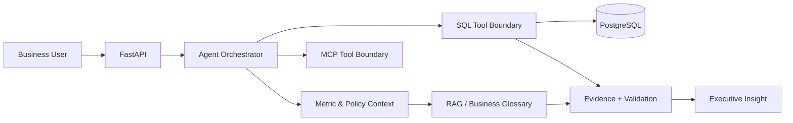

# Enterprise BI Copilot

> A production-oriented business intelligence copilot that translates governed business questions into explainable SQL insights and executive-ready answers.

[](https://github.com/SagarAnwekar/enterprise-bi-copilot/actions/workflows/ci.yml)

## Why this exists

Business users rarely ask for SQL. They ask questions such as **"Why did revenue fall last month?"** or **"Which product categories need attention?"**.

This project demonstrates how to turn those questions into a controlled analytics workflow rather than a free-form chatbot.

## Current scope

- FastAPI service boundary for analytics requests
- PostgreSQL-oriented data layer and SQL execution boundary
- LangGraph-style orchestration documented as the target agent workflow
- Retrieval layer for business definitions and metric context
- MCP integration boundary documented for future governed tools
- Executive insight output with evidence, assumptions, and caveats
- Automated tests and GitHub Actions quality gates

**Important:** this repository is being built incrementally. The architecture is documented ahead of implementation so each milestone can be reviewed independently; the README does not claim production deployment that does not yet exist.

## Architecture



See [`docs/architecture.md`](docs/architecture.md) for component boundaries and trade-offs.

## Target repository structure

```text
enterprise-bi-copilot/
├── app/
│   ├── api/
│   ├── domain/
│   ├── services/
│   └── main.py
├── tests/
├── docs/
├── data/
├── .github/
│   ├── ISSUE_TEMPLATE/
│   ├── workflows/
│   └── pull_request_template.md
├── Dockerfile
├── docker-compose.yml
├── pyproject.toml
├── SECURITY.md
├── LICENSE
└── README.md
```

## Quality contract

Every meaningful change should leave a traceable engineering artifact: tests for behavior, CI for repeatability, docs for non-obvious decisions, small semantic commits, no secrets or customer data, and measurable business assumptions where applicable.

## Planned milestones

| Milestone | Evidence | Status |
|---|---|---|
| Architecture contract | ADR + diagram | ✅ |
| API boundary | FastAPI endpoint + validation | 🔜 |
| Data layer | PostgreSQL schema + queries | 🔜 |
| Agent orchestration | graph + guardrails | 🔜 |
| RAG glossary | retrieval + citations | 🔜 |
| MCP tools | governed tool interface | 🔜 |
| Evaluation | golden questions + metrics | 🔜 |
| Deployment | container + environment guide | 🔜 |

## Interview surface

This project is designed to answer practical questions about SQL generation validation, database permissions, RAG versus direct querying, latency/cost/accuracy trade-offs, deterministic evaluation, and business-metric governance.

## License

MIT. See [`LICENSE`](LICENSE).
